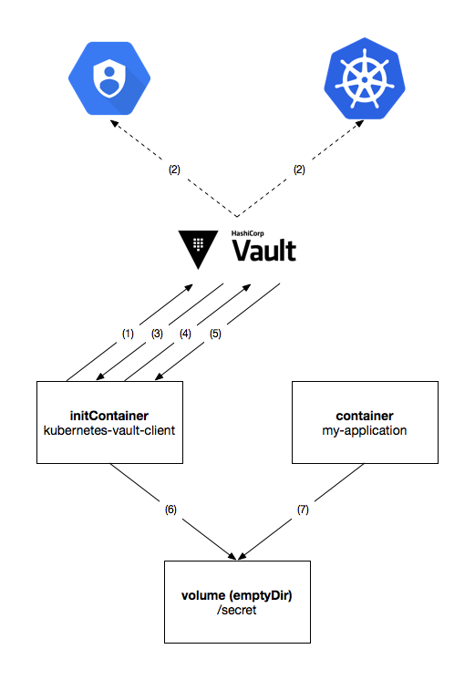

= kubernetes-vault-client
:icons: font
:toc:

ifdef::env-github[]
:tip-caption: :bulb:
:note-caption: :information_source:
:important-caption: :heavy_exclamation_mark:
:caution-caption: :fire:
:warning-caption: :warning:
endif::[]

== Before Proceeding

One is highly encouraged to be familiar with the following concepts before
proceeding:

* https://kubernetes.io/docs/tasks/configure-pod-container/configure-service-account/[Kubernetes service accounts]
  and https://kubernetes.io/docs/admin/authorization/rbac/[RBAC].
* https://cloud.google.com/compute/docs/access/service-accounts[GCP service accounts].
* Vault's https://www.vaultproject.io/docs/auth/kubernetes.html[Kubernetes authentication backend].
* Vault's https://www.vaultproject.io/docs/auth/gcp.html[GCP authentication backend].

== Introduction

`kubernetes-vault-client` helps Kubernetes applications access Vault secrets in
a secure way. It runs as an
https://kubernetes.io/docs/concepts/workloads/pods/init-containers/[*_init container_*]
that authenticates with Vault and dumps secrets as files to a shared volume:

[#img-overview]
.Overview of the application.

. `kubernetes-vault-client` authenticates with Vault using a
https://www.vaultproject.io/docs/auth/gcp.html[`gcp`] or
https://www.vaultproject.io/docs/auth/kubernetes.html[`kubernetes`]
authentication backend by sending a *_signed token_* made available to the
container.
. The target authentication backend verifies the authenticity of the signed
token with Google Cloud IAM or the source Kubernetes cluster, respectively.
. Upon successful authentication, Vault responds to `kubernetes-vault-client`
with a *_Vault token_* that can be used to request secrets and certificates
from https://www.vaultproject.io/docs/secrets/kv/index.html[`kv`]
footnote:[Generic secrets like passwords and API keys.] and
https://www.vaultproject.io/docs/secrets/kv/index.html[`pki`]
footnote:[Certificates used for setting up TLS and for mutual-TLS authentication.]
secret backends, respectively.
. `kubernetes-vault-client` then requests the necessary secrets and
certificates from Vault, according to the provided
<<#configuration,configuration>>.
. Vault responds to `kubernetes-vault-client` with the requested secrets and
certificates.
. `kubernetes-vault-client` then dumps these secrets and certificates into a
shared volume pre-configured in the
https://kubernetes.io/docs/api-reference/v1.8/#podspec-v1-core[`PodSpec`] —
ideally one of type `emptyDir` and spec `medium: Memory` — and exits.
. The application reads the necessary secrets and certificates from the
`emptyDir` volume when necessary.

== Building

The easiest way to build `kubernetes-vault-client` is to build the included
`Dockerfile` with Docker ≥ 17.06:

[source,bash]
----
$ docker build -t kubernetes-vault-client:latest .
Sending build context to Docker daemon    165MB
Step 1/8 : FROM golang:1.9.2-alpine AS builder
(...)
Successfully built 8793dbaf2b20
Successfully tagged kubernetes-vault-client:latest
----

== Configuration

=== Common Properties

`kubernetes-vault-client` reads its configuration from an YAML file. The actual
format of the YAML file is dependent on the type of authentication being used —
`iam` or `kubernetes` — but it must conform to a well-defined schema:

[source,yaml]
----
address: <string>
auth:
  type: (iam|kubernetes)
  backend: <string>
  data: ({iam-cfg}|{kubernetes-cfg})
mode:
  name: initC
  data:
    kv:
    - path: <string>
      key: <string>
      mountPath: <string>
    (...)
    pki:
    - mountName: <string>
      role: <string>
      cn: <string>
      sans:
      - <string>
      (...)
      cnIsIdentifier: (true|false)
      mountDir: <string>
    (...)
----

A description of each property is given in the following table:

|===
| Property | Description

| `.address` | The address where Vault can be reached.
| `.auth.type` | The type of authentication being used (either `iam` or `kubernetes`).
| `.auth.backend` | The mount path of the target authentication backend in Vault.
| `.auth.data` | Backend-specific configuration (see below).
| `.mode.name` | The fixed value `initC` (which stands for *_init container_*).
| `.data.kv` | A list of requests for secrets from `kv` backends.
| `.data.kv.path` | The full path to the requested secret in Vault (i.e., `<mount-name>/<secret-name>`).
| `.data.kv.key` | The requested key.
| `.data.kv.mountPath` | The path where the value will be mounted. It should be a path inside the shared volume.
| `.data.pki` | A list of requests for secrets from `pki` backends.
| `.data.pki.mountName` | The path to the `pki` backend.
| `.data.pki.role` | The name of the https://www.vaultproject.io/docs/secrets/pki/index.html#configure-a-role[role] being requested.
| `.data.pki.cn` | The *_common name_* (`CN`) requested for the certificate.
| `.data.pki.sans` | An optional list of *_subject alternative names_* requested for the certificate. May include both hostnames and IP addresses.
| `.data.pki.cnIsIdentifier` | Whether the requested `CN` is an identifier instead of a domain name or IP address.
| `.data.pki.mountDir` | The path where the certificate bundle will be mounted. It should be a path inside the shared volume.
|===

=== Authentication with Kubernetes

Authentication with a Kubernetes backend is the simplest form of configuration.
It takes a single configuration property:

|===
| Property | Description

| `.auth.data.role` | The https://www.vaultproject.io/docs/auth/kubernetes.html#creating-a-role[role] to be used when authenticating with the `kubernetes` backend.
|===

One should note that if RBAC is enabled in the cluster where
`kubernetes-vault-client` will be deployed, the service account and namespace
under which `kubernetes-vault-client` will run must be authorized to perform
*_token review_* operations. For instance, if `kubernetes-vault-client` runs
under the `my-application` service account in the `my-namespace` namespace, a
`ClusterRoleBinding` similar to the following must be created for Kubernetes
authentication to work:

[source,yaml]
----
apiVersion: rbac.authorization.k8s.io/v1beta1
kind: ClusterRoleBinding
metadata:
  name: my-application-my-namespace-tokenreview-binding
  namespace: default
roleRef:
  apiGroup: rbac.authorization.k8s.io
  kind: ClusterRole
  name: system:auth-delegator
subjects:
- kind: ServiceAccount
  name: my-application
  namespace: my-namespace
----

==== Example

[source,yaml]
----
address: https://vault.example.com
auth:
  type: kubernetes
  backend: kubernetes
  data:
    role: test-role
mode:
  name: initC
  data:
    kv:
    - path: secret/foo
      key: one
      mountPath: /secret/foo/one
    - path: secret/foo
      key: two
      mountPath: /secret/foo/two
    - path: secret/bar
      key: one
      mountPath: /secret/bar/one
    pki:
    - mountName: intermediate-ca
      role: my-application
      cn: my-application.my-namespace.svc.cluster.local
      sans:
      - my-application.my-namespace
      - my-application
      - localhost
      - 127.0.0.1
      cnIsIdentifier: false
      mountDir: /secret
----

=== Authentication with Google Cloud IAM

Authentication with Google Cloud IAM requires three configuration properties:

|===
| Property | Description

| `.auth.data.role` | The https://www.vaultproject.io/docs/auth/gcp.html#create-a-role[role] to be used when authenticating with the `gcp` backend.
| `.auth.data.serviceAccountId` | The ID of the https://cloud.google.com/compute/docs/access/service-accounts[service account] with which to authenticate against Google Cloud IAM.
| `.auth.data.signingServiceAccountKeyPath` | The path to the private key of the service account that will sign tokens on behalf of `.auth.data.serviceAccountId`. This should be provided as a secret to the pod.
|===

The `.auth.data.signingServiceAccountKeyPath` property exists to support
use-cases where there is a "global" service account responsible for signing
tokens. For instance, one may wish to have a single `vault-authn` service
account belonging to the project where Vault is deployed and use it to sign
tokens in several different projects. This service account must have the
`roles/iam.serviceAccountKeyAdmin` and `roles/iam.serviceAccountTokenCreator` in
each project where `kubernetes-vault-client` is deployed.

==== Example

[source,yaml]
----
address: https://vault.example.com
auth:
  type: iam
  backend: gcp
  data:
    role: test-role
    serviceAccountId: my-app@my-project.iam.gserviceaccount.com
    signingServiceAccountKeyPath: /credentials/vault-authn.json
mode:
  name: initC
  data:
    kv:
    - path: secret/foo
      key: one
      mountPath: /secret/foo/one
    - path: secret/foo
      key: two
      mountPath: /secret/foo/two
    - path: secret/bar
      key: one
      mountPath: /secret/bar/one
    pki:
    - mountName: intermediate-ca
      role: my-application
      cn: my-application.my-namespace.svc.cluster.local
      sans:
      - my-application.my-namespace
      - my-application
      - localhost
      - 127.0.0.1
      cnIsIdentifier: false
      mountDir: /secret
----

=== Using a `ConfigMap`

`kubernetes-vault-client` is meant to be deployed to a Kubernetes cluster, and
as such the preferred way to provide it with the configuration file is to use a
https://kubernetes.io/docs/tasks/configure-pod-container/configmap/[`ConfigMap`]:

[source,yaml]
----
apiVersion: v1
data:
  config.yaml: |
    address: https://vault.example.com
    auth:
      type: kubernetes
      backend: kubernetes
      data:
        role: test-role
    mode:
      name: initC
      data:
        kv:
        - path: secret/foo
          key: one
          mountPath: /secret/foo/one
kind: ConfigMap
metadata:
  name: my-kubernetes-vault-client-config
----

`kubernetes-vault-client` expects the configuration file to be present at
`/config/config.yaml`. The path can be overriden using the `--config` flag.

== Debugging `kubernetes-vault-client`

In order to debug `kubernetes-vault-client` one may use the `--debug` flag. This
will make the output more verbose, but will also disclose sensitive information
like Kubernetes and Vault tokens. One may use this flag whenever necessary when
testing the deployment of a given application, but must remember to *_remove it
before moving to production_*.

== Example

A comprehensive usage example of `kubernetes-vault-client` can be found https://github.com/travelaudience/kubernetes-vault-example[here].
